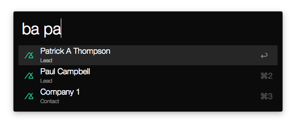

# Alfred 2 Base CRM Workflow 

Provides easy access to Base CRM contacts, leads, and deals inside Alfred 2 (plus caching!).

## Getting Started

Download this [bad boy](https://github.com/johnthepink/alfred2-basecrm/raw/master/alfred2-basecrm.alfredworkflow), and open to install. Then:

1. Right click on the ba Script Filter and click Configure.
2. Fill in your Base CRM api key.
3. Have fun.

This will cache your results, so if you need to refresh start your query with: !

## Contributing

1. Fork this repository.
2. Run `rake install` to symlink the directory in to Alfred.
3. Run `rake bundle:install` to bundle any gems locally.
4. Add your feature.
5. Pull requests welcome! :)
